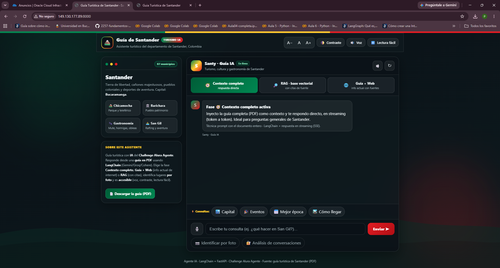
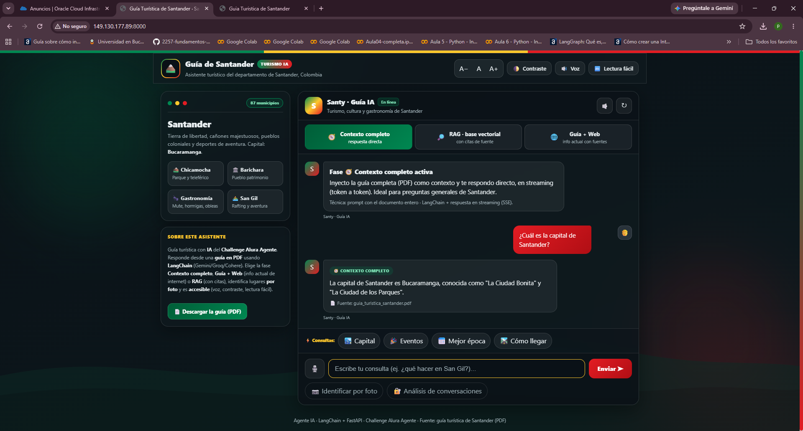
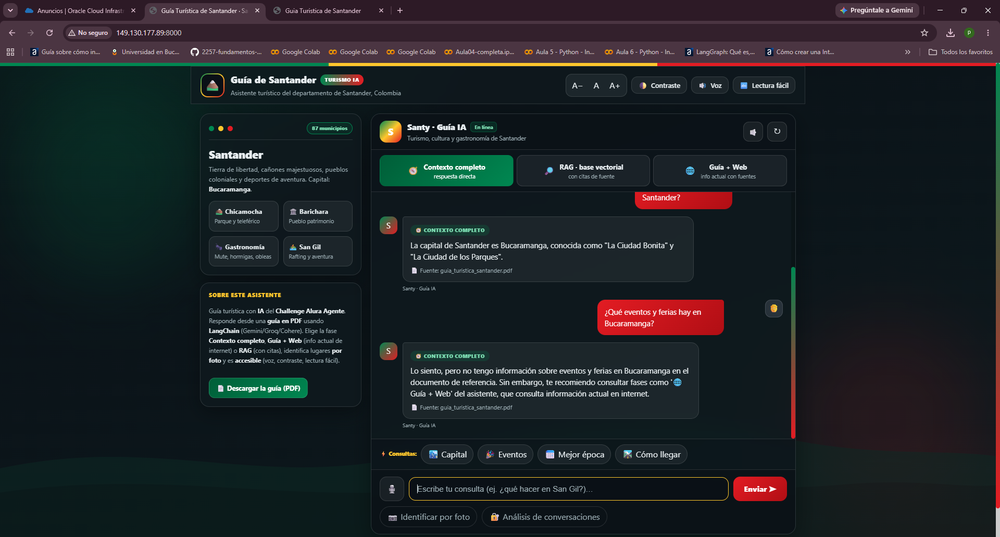
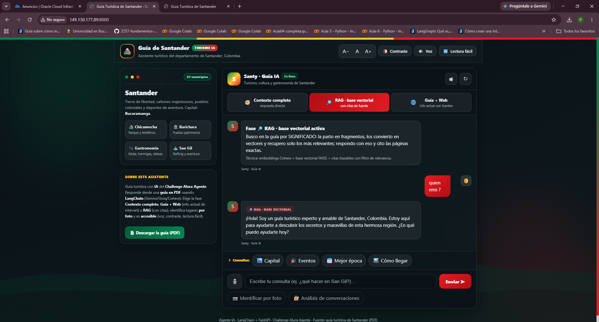
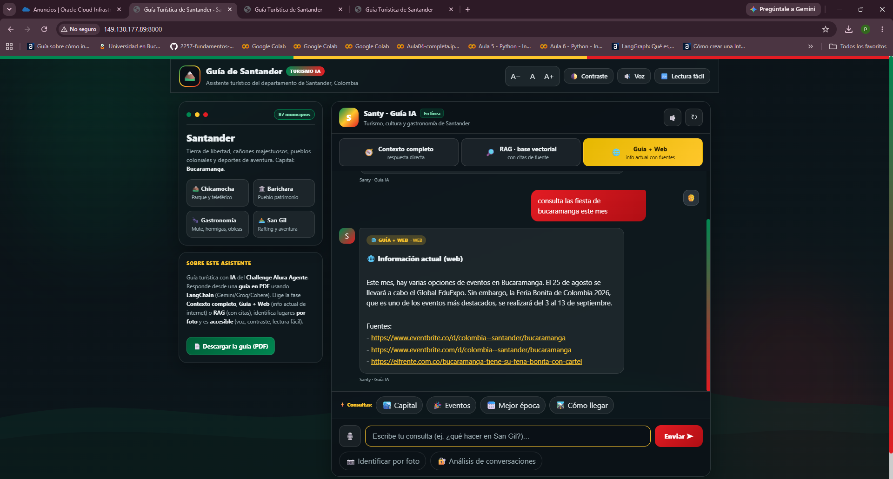
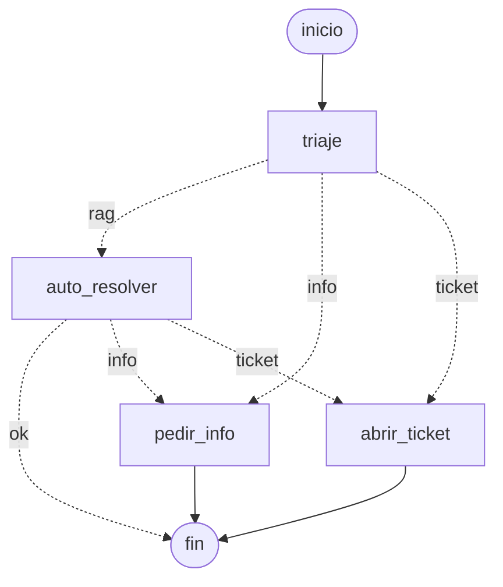

# 🏔️ Agente Turístico de Santander — Challenge Alura Agente

Agente de inteligencia artificial que responde preguntas sobre los **sitios turísticos del
departamento de Santander, Colombia**, a partir de una **guía en PDF**. Está orquestado con
**LangChain / LangGraph** y usa varios modelos de lenguaje (**Gemini**, **Groq** o **Cohere**)
con **respaldo automático** entre ellos y un **limitador de peticiones** para no exceder los
free tiers. Se expone con una **API FastAPI** y una **interfaz web de chat** con tres modos de
respuesta (contexto completo, **guía + web** y RAG), **respuestas en streaming**, análisis de
imágenes, generación de **itinerarios multiagente**, análisis de datos y una interfaz
**accesible**. Se despliega en **Oracle Cloud Infrastructure (OCI Compute)**.

> 🔗 **App desplegada (OCI — Bogotá):** http://149.130.177.89:8000 &nbsp;·&nbsp; Proyecto para el **Challenge Alura Agente**.

---

## 📖 Descripción general

El agente responde en lenguaje natural (p. ej. *"¿dónde puedo practicar rafting?"*) con base en
la guía turística en PDF. Sobre esa base ofrece **varios modos de interacción** ("fases"), cada
uno con una técnica distinta de LangChain/LangGraph, más análisis de imágenes, de datos e
itinerarios:

| Modo / servicio | Endpoint | Qué hace |
|---|---|---|
| 🧭 **Contexto completo** | `POST /ask` · `/ask/stream` | Inyecta el PDF completo como contexto (modo por defecto). |
| 🌐 **Guía + Web** | `POST /grafo/combinado` | Grafo LangGraph: **enruta** a la guía, a la **web (Tavily)** o a ambas, y combina; trae eventos/clima/precios **actuales** con fuentes. |
| 🔎 **RAG · base vectorial** | `POST /rag/ask` · `/rag/ask/stream` | Embeddings + FAISS/Pinecone; respuesta **con citaciones** (página + fuente). |
| 🤖 **Agente ReAct** | `POST /agente` | Razona y **elige la herramienta** adecuada (guía, historial, explicar, **búsqueda web**); con **memoria** de la conversación. |
| 🕸️ **Grafo de estados** | `POST /grafo/ask` | Triaje → auto-resolver (RAG) / pedir info / abrir ticket. |
| 🧳 **Itinerario multiagente** | `POST /itinerario` | Planifica → investiga (web + guía) → redacta → revisa, en un grafo con loop de revisión. |
| 🖼️ **Visión** | `POST /vision` | Identifica lugares/platos/actividades en una foto (Gemini multimodal). |
| 📊 **Análisis de datos** | `POST /datos/analizar` | Explora, grafica y consulta el historial de conversaciones (admin). |
| 📄 **Descarga de la guía** | `GET /guia.pdf` | Descarga el documento fuente del agente. |

El **frontend** incluye un **selector de tres fases** (Contexto completo · RAG · Guía + Web), con
**respuestas en streaming**, botones de visión, descarga del PDF y análisis de administración, y
opciones de **accesibilidad** (tamaño de letra, alto contraste, lectura fácil, **voz** y
**dictado**). Todos los modos comparten la **capa LLM multi-proveedor con respaldo y rate
limiter** y la **memoria por sesión**.

**Modo por defecto — inyección de contexto completo.** Como la guía es pequeña (5 páginas),
`/ask` entrega el **texto completo del PDF como contexto** en cada pregunta. Aprovechando la
amplia ventana de contexto de los LLM actuales, esto es más simple, preciso y económico que un
pipeline de embeddings para un documento de ese tamaño. Para escalar a documentos grandes está
la fase **RAG**, y para información **actual** (que no está en el PDF), la fase **Guía + Web**.

---

## 🏗️ Arquitectura de la solución

```
                          ┌─────────────────────────────────────────────┐
   Usuario  ──HTTP──────▶ │                 FastAPI (app)                │
 (navegador / API)        │  / /ask /rag/ask /grafo/combinado /agente …  │
                          └───────┬─────────────────────┬───────────────┘
                                  │                     │
              ┌───────────────────┘                     └───────────────┐
              ▼                                                          ▼
   ┌────────────────────┐   PDF (contexto)              ┌───────────────────────────┐
   │  Agente Q&A        │◀────── PDF Loader (pypdf)      │   Memoria (CSV + pandas)  │
   │ (contexto completo)│                               │   filtro por session_id   │
   └─────────┬──────────┘                               └───────────────────────────┘
             │  prompt (documento + memoria + pregunta)
             ▼
   ┌──────────────────────────────────────────────────────────────────┐
   │  Capa LLM (LangChain, LCEL) — respaldo + rate limiter por proveedor│
   │  Gemini 2.5 Flash  →  Groq (Llama/Gemma)  →  Cohere   (según cupo) │
   └──────────────────────────────────────────────────────────────────┘
             │
             ▼
     Respuesta en lenguaje natural (en streaming en el chat)

  Modos y extras:
    /grafo/combinado → grafo router → guía / web (Tavily) / ambas → supervisor
    /rag/ask         → RAG con base vectorial (FAISS/Pinecone) + citaciones
    /agente          → agente ReAct (LangGraph) con herramientas + memoria
    /grafo/ask       → grafo de estados (triaje + RAG)
    /itinerario      → multiagente (plan → investigar → redactar → reflexionar)
    /vision          → Gemini multimodal (JSON estructurado)
    /datos/analizar  → agente de análisis de datos (router + pandas/gráficos)
```

**Flujo del chat principal (`/ask`) y servicios compartidos:**
1. **Al iniciar:** se lee el PDF y su texto queda cargado en memoria como contexto.
2. **Por cada pregunta:** se arma el prompt (documento + memoria + pregunta) y se envía a la
   capa LLM, que elige el proveedor, aplica el **respaldo** si uno se queda sin cupo y **espacia
   las llamadas** con el rate limiter para no superar el RPM del free tier.
3. **Streaming (SSE):** el chat usa `/ask/stream` y `/rag/ask/stream`, que emiten la respuesta
   **token a token** para una experiencia fluida.
4. **Memoria por sesión (CSV + pandas):** cada usuario se identifica con un `session_id`
   generado en el frontend (sin registro). Cada intercambio se guarda en `data/historial.csv`;
   antes de responder se **filtra por `session_id`** para dar continuidad. La memoria está
   *scopeada por fase* (`:rag`, `:agente`) para no mezclar contextos. `GET /history` lista,
   consulta o **busca** (`?q=...`).
5. **Análisis de conversaciones (admin):** `POST /admin/analisis` lee el historial con pandas,
   pide al LLM que **clasifique las preguntas en categorías (JSON)** y responde qué temas se
   consultan más (pandas + LLM + JSON).
6. **Análisis de imágenes (visión):** `POST /vision` codifica la foto en base64 y la envía a
   **Gemini visión** con **salida estructurada** (`with_structured_output` + `Literal`),
   devolviendo un objeto validado (`titulo`, `descripcion`, `etiquetas`, `tipo`, `relacion_santander`).

### Estructura del repositorio

```
alura-latam/
├── app/
│   ├── main.py            # API FastAPI (endpoints + interfaz + streaming)
│   ├── agent.py           # Agente Q&A por contexto completo (PDF + LLM)
│   ├── pdf_loader.py      # Lectura y limpieza del texto del PDF
│   ├── memory.py          # Memoria de conversaciones en CSV (pandas + filtros)
│   ├── analytics.py       # Análisis de conversaciones (pandas + LLM + JSON)
│   ├── vision.py          # Análisis de imágenes con Gemini visión (multimodal)
│   ├── rag.py             # RAG real (chunks + embeddings + FAISS/Pinecone) — /rag/ask
│   ├── llm.py             # Capa LLM (Gemini/Groq/Cohere + fallback + rate limiter)
│   ├── tools.py           # Herramientas del agente ReAct (incl. búsqueda web Tavily)
│   ├── orchestrator.py    # Agente ReAct con LangGraph + memoria — /agente
│   ├── graph.py           # Grafo de estados: triaje + RAG — /grafo/ask
│   ├── grafo_combinado.py # Grafo router → guía/web/ambas → supervisor — /grafo/combinado
│   ├── itinerario.py      # Itinerario multiagente (plan→investigar→redactar→reflexionar)
│   ├── datos.py           # Agente de análisis de datos (router + 4 herramientas)
│   └── config.py          # Configuración desde variables de entorno
├── static/index.html      # Interfaz web de chat (3 fases, streaming, accesible)
├── tests/test_agent.py    # Tests unitarios (sin llamar a la API)
├── data/
│   ├── guia_turistica_santander.pdf   # Documento fuente (guía de 5 páginas)
│   ├── guia_turistica_santander.md    # Versión editable
│   └── historial.csv                  # Memoria de conversaciones (runtime)
├── docs/                  # Capturas del deploy
├── requirements.txt · Dockerfile · .env.example · README.md
```

---

## 🛠️ Tecnologías y herramientas

| Categoría        | Herramienta                                   |
|------------------|-----------------------------------------------|
| Lenguaje         | Python 3.11+                                  |
| API web          | FastAPI + Uvicorn (respuestas en streaming SSE) |
| Orquestación     | **LangChain** (LCEL) + **LangGraph** (grafos y agentes) |
| IA / LLM         | **Gemini 2.5 Flash**, **Groq** (Llama/Gemma) o **Cohere** — con respaldo + rate limiter |
| Búsqueda web     | **Tavily** (`langchain-tavily`) para info actual |
| Lectura de PDF   | pypdf                                          |
| RAG / vectores   | **FAISS** (persistido) o **Pinecone** (nube) + embeddings de Cohere |
| Memoria / datos  | pandas (CSV de sesiones, filtros)             |
| Análisis de datos| **PythonAstREPLTool** (ejecuta pandas) + matplotlib/seaborn |
| Nube / Deploy    | Oracle Cloud Infrastructure (OCI Compute)     |
| Frontend         | HTML + CSS + JavaScript (vanilla): 3 fases, streaming, accesibilidad |
| Testing          | pytest                                        |

---

## 🚀 Instrucciones para ejecutar el proyecto

### 1. Requisitos previos
- Python 3.11 o superior.
- Una **API key gratuita** de al menos un proveedor de LLM (puedes usar los tres y el sistema
  alterna entre ellos con respaldo):
  - **Google Gemini** — [Google AI Studio](https://aistudio.google.com/app/apikey) *(por defecto; requerido para la visión)*.
  - **Groq** — [console.groq.com/keys](https://console.groq.com/keys) *(muy rápido)*.
  - **Cohere** — [dashboard.cohere.com/api-keys](https://dashboard.cohere.com/api-keys) *(fuerte en español; también hace los embeddings del RAG)*.
- *(Opcional)* **Tavily** — [tavily.com](https://tavily.com) para la fase **Guía + Web** (sin ella, esa fase se degrada con elegancia).

### 2. Clonar e instalar dependencias
```bash
git clone https://github.com/AndrewCarvajal97/agente-turistico-santander.git
cd agente-turistico-santander
python -m venv venv
# Windows:
venv\Scripts\activate
# Linux/Mac:
source venv/bin/activate
pip install -r requirements.txt
```

### 3. Configurar las variables de entorno
```bash
cp .env.example .env
```
Edita `.env` con tu clave. **Por defecto** el proveedor principal es **Gemini 2.5 Flash** (mejor
free tier), con respaldo automático a Groq y Cohere:
```
LLM_PROVIDER=gemini
GEMINI_API_KEY=AIza...tu_clave...
GEMINI_CHAT_MODEL=gemini-2.5-flash
# (opcional) respaldo y web
GROQ_API_KEY=gsk_...
COHERE_API_KEY=...
TAVILY_API_KEY=tvly-...
```
El **rate limiter** por proveedor (`GEMINI_RPM`, `GROQ_RPM`, `COHERE_RPM`) evita superar el RPM
del free tier; sus valores por defecto ya son seguros.

### 4. Levantar la aplicación
```bash
uvicorn app.main:app --host 0.0.0.0 --port 8000
```
Abre **http://localhost:8000** para el chat, o **http://localhost:8000/docs** para la API.

### 5. (Opcional) Ejecutar los tests
```bash
python -m pytest -q
```

---

## ☁️ Despliegue en OCI

El agente se despliega en una **instancia Compute** de OCI (una VM). Los LLM se consumen por API,
así que basta con definir la clave del proveedor en el `.env` del servidor. Pasos resumidos:

1. Crear la VM (Oracle Linux / Ubuntu) y abrir el puerto `8000` en la *Security List* / *NSG*.
2. Conectarse por SSH y preparar el entorno:
   ```bash
   git clone https://github.com/AndrewCarvajal97/agente-turistico-santander.git
   cd agente-turistico-santander
   python3 -m venv venv && source venv/bin/activate
   pip install -r requirements.txt
   cp .env.example .env          # edita .env y coloca tus API keys
   nohup uvicorn app.main:app --host 0.0.0.0 --port 8000 > app.log 2>&1 &
   ```
3. *(Opcional)* Contenerizar con el `Dockerfile` incluido.

> 🔗 **Aplicación desplegada (OCI Compute — Bogotá):** http://149.130.177.89:8000
> 🖼️ **Evidencia:** ver las [capturas](#-capturas-de-la-aplicación-desplegada-en-oci) abajo.

**Detalles del despliegue:**
- Región: **Colombia Central (Bogotá)** — `sa-bogota-1`
- Instancia: `VM.Standard.E5.Flex` (Oracle Linux 9)
- Servidor: `uvicorn` en el puerto `8000` (abierto en firewalld + Security List)

### 📸 Capturas de la aplicación (desplegada en OCI)

La aplicación corriendo en la instancia OCI (IP pública `149.130.177.89:8000`), con las **tres
fases** de respuesta, **descarga del PDF** y opciones de **accesibilidad**:



**Fase "Contexto completo"** — inyecta el PDF completo y responde directo, citando la fuente:



**Honestidad ante datos que no están en la guía** — no inventa eventos: lo aclara y **remite a la fase Guía + Web**:



**Fase "RAG · base vectorial"** — busca por significado en la guía (embeddings de Cohere + FAISS) con citaciones trazables:



**Fase "Guía + Web"** — combina la guía con **información ACTUAL de internet** (Tavily): trae eventos reales de Bucaramanga con **fuentes clicables**:



---

## 💬 Ejemplos de preguntas

- ¿Cuál es la capital de Santander?
- ¿Dónde puedo practicar rafting y en qué ríos?
- ¿Por qué Barichara es tan famosa? ¿Qué es el Camino Real?
- ¿Qué comida típica debo probar en Santander?
- *(Fase Guía + Web)* ¿Qué eventos o ferias hay próximamente en Bucaramanga? ¿Cómo está el clima hoy?

> **Pregunta:** ¿Dónde puedo practicar rafting?
> **Respuesta:** Puedes practicar rafting en **San Gil**. El **río Fonce** es ideal para
> principiantes y el **río Suárez** para personas con experiencia.

_(Las respuestas se generan dinámicamente con el LLM configurado, a partir del PDF y —en la fase web— de internet.)_

---

## 📄 Documento fuente

El agente responde a partir de [`data/guia_turistica_santander.pdf`](data/guia_turistica_santander.pdf),
una guía de 5 páginas que cubre destinos, deportes de aventura, gastronomía, transporte, mejor
época para visitar y preguntas frecuentes de Santander. Se puede **descargar desde la propia app**
(botón "📄 Descargar la guía") o vía `GET /guia.pdf`.

---

## 🌐 Fase "Guía + Web" — grafo router → guía / web / ambas

En `POST /grafo/combinado` ([grafo_combinado.py](app/grafo_combinado.py)) un **grafo LangGraph**
combina las dos fuentes que tienen sentido para turismo: la **guía** (lo estático) y la **web**
(lo actual: eventos, clima, precios). Es el patrón *router → nodos → supervisor* del curso,
adaptado y de **bajo costo**:

```
START → router → { guía | web | ambas } → supervisor → END
```

- **router:** clasifica la pregunta. Un **atajo por palabras clave** (eventos, clima, precios,
  fechas) enruta directo a `web` **sin gastar la llamada del LLM**; el resto usa una clasificación
  estructurada (`with_structured_output` + `Literal`).
- **web:** usa la herramienta `busca_web` (**Tavily**, con `include_answer` y fecha actual) y
  **sintetiza la respuesta en español** conservando las fuentes.
- **supervisor:** combina guía + web **en código** (0 llamadas al LLM).

## 🔎 RAG real (embeddings + base vectorial) — vía paralela

En `POST /rag/ask` ([rag.py](app/rag.py)): se cargan **todos los PDFs** de una carpeta con
`DirectoryLoader`, se dividen en *chunks* (`RecursiveCharacterTextSplitter` o **`SemanticChunker`**),
cada chunk se convierte en un **vector** con **embeddings de Cohere** (o Gemini) y se indexa en una
**base vectorial**. Por defecto el retriever usa **`similarity` top-k** (mejor recall; con
`RAG_SCORE_THRESHOLD>0` se activa el umbral) y hay un **fallback** a `similarity_search` para no
quedarse sin contexto. La respuesta es estructurada `{respuesta, citaciones, documentos_encontrados}`
y cada **citación** es trazable (fragmento + **página** + archivo). Se muestran **solo las citas
realmente usadas** (filtro por solape léxico), la fase tiene **memoria** de conversación y se
**limpian caracteres de control** del texto extraído. Si el modelo no halla la respuesta, dice
**"No lo sé"** (evita alucinar). Requiere `COHERE_API_KEY`.

> 🖥️ En el frontend, el **selector de fase** diferencia *Contexto completo*, *RAG* (con
> citaciones desplegables) y *Guía + Web*.

### 🗄️ Base vectorial intercambiable (patrón *strategy*)

| Backend | `RAG_VECTORSTORE` | Descripción |
|---|---|---|
| **FAISS** (por defecto) | `faiss` | Local y **persistido** (`data/faiss_index/`): si existe se **carga** (no reindexa ni gasta cuota en cada arranque). |
| **Pinecone** | `pinecone` | **En la nube** (serverless): persiste fuera del servidor y escala. Crea el índice con la dimensión correcta (Cohere `embed-multilingual-v3.0` = 1024). Requiere `PINECONE_API_KEY`. |

`POST /rag/reindex` (admin) reconstruye el índice al agregar/quitar PDFs. Extras opt-in:
**multi-query** (`RAG_MULTIQUERY`) y **LangSmith** (`LANGSMITH_TRACING`); `GET /health` reporta su estado.

## 🤖 Agente orquestador (ReAct) + herramientas — vía paralela

En `POST /agente` ([orchestrator.py](app/orchestrator.py)), un **agente ReAct** con **LangGraph**
(`create_react_agent`) **razona y decide** qué herramienta usar. Las herramientas
([tools.py](app/tools.py)) son `guia_turistica` (Q&A del PDF), `buscar_historial` (memoria),
`explicar` (didáctica, con **Cohere**) y **`busca_web`** (Tavily, info actual). Tiene **memoria**
de la conversación (checkpointer `MemorySaver`), **respaldo entre proveedores** (`bind_tools` por
proveedor + `with_fallbacks`) y controles de costo: **tope de pasos** (`AGENTE_MAX_PASOS`) y
**caché anti-bucle** de herramientas.

## 🕸️ Agente con grafo de estados (LangGraph) — vía paralela

En `POST /grafo/ask` ([graph.py](app/graph.py)), un agente modelado como **grafo de estados**:



El **triaje** clasifica con `with_structured_output` (Pydantic + `Literal`) y una **arista
condicional** enruta; tras el RAG, una **segunda condicional** decide terminar, pedir info o abrir
ticket. `GET /grafo/diagrama` devuelve el grafo en Mermaid.

## 🧳 Itinerario multiagente — vía paralela

En `POST /itinerario` ([itinerario.py](app/itinerario.py)), un **multiagente** con LangGraph arma
un itinerario de viaje combinando guía + web, con un **loop de revisión** acotado por costo:

```
START → plan → investigar → redactar → [reflexionar → redactar]* → END
```

`ITINERARIO_MAX_REVISIONES` limita las rondas (1 = un solo borrador). `GET /itinerario/diagrama`
devuelve el grafo en Mermaid.

## 📊 Agente de análisis de datos — vía paralela

En `POST /datos/analizar` ([datos.py](app/datos.py)), un **agente de análisis** aplicado a los
**datos reales del proyecto**: por defecto el **historial de conversaciones** (`data/historial.csv`)
o un CSV que se suba. Un **router** (salida estructurada `Literal`) enruta a **4 herramientas**:

| Herramienta (`accion`) | Qué hace |
|---|---|
| `explorar` | Reporte general: dimensiones, columnas y tipos, nulos, duplicados. |
| `estadisticas` | Interpreta `df.describe()` de las columnas numéricas. |
| `grafico` | El LLM genera código **matplotlib/seaborn**, se **ejecuta** y devuelve un **PNG** (base64). |
| `pregunta` | El LLM genera código pandas, **PythonAstREPLTool lo EJECUTA** sobre el `df` y responde en lenguaje natural. |
| `auto` | El **router** elige la herramienta según la solicitud. |

> ⚠️ Ejecuta código Python generado por el LLM: el endpoint está **protegido con `ADMIN_KEY`** y
> con límite de tamaño (2 MB). No exponer al público sin sandbox.

---

## 🔁 Multi-proveedor con respaldo y rate limiter

La capa LLM ([llm.py](app/llm.py)) responde con **Gemini 2.5 Flash → Groq → Cohere** (orden según
`LLM_PROVIDER`). Si un proveedor/modelo se queda sin cupo (429) o falla, **cae al siguiente**
(`with_fallbacks`), de forma transparente para el usuario. Además, un **`InMemoryRateLimiter`
compartido por proveedor** **espacia** las llamadas para no superar el RPM del free tier — clave
para el agente ReAct, que encadena varias llamadas. Cohere, además de responder, hace los
**embeddings** del RAG.

## ⚡ Respuestas en streaming (SSE)

El chat usa `POST /ask/stream` y `POST /rag/ask/stream`, que envían la respuesta **token a token**
por *Server-Sent Events*, y al final adjuntan la fuente/citaciones. La interfaz va llenando la
burbuja en tiempo real.

## ♿ Accesibilidad

La interfaz ([static/index.html](static/index.html)) incluye **tamaño de letra ajustable**,
**alto contraste** (blanco y negro según buenas prácticas WCAG), **lectura fácil** (tipografía
espaciada), **lectura por voz (TTS)** de las respuestas y **dictado por voz** de las preguntas.
Es *self-contained* (sin CDNs) con un tema tricolor inspirado en la bandera de Santander.

## 🗺️ Roadmap / próximos pasos

- Acceso por HTTPS con dominio (Caddy + DuckDNS o Load Balancer de OCI).
- Interfaz dedicada para el agente de análisis de datos (subida de CSV + botones).
- Más herramientas para el orquestador (p. ej. consulta a una base de datos).

---

## 📝 Licencia

Proyecto educativo desarrollado para el Challenge Alura Agente.
